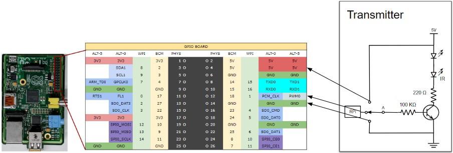

# Materials
* ½ size breadboard
* NPN transistor
* Two resistors: 100kΩ and 220Ω
* LED
* IR-LED
* Breadboard cables as needed (I use AWG22)
* Circuit and Connections

We use the following circuit: 
This circuit will serve two purposes: (1) it can be used to test a particular pin using the LED, (2) it will emit IR using the IR-LED.

The **ground is connected to a ground** (like PIN 6).

We **connect the power to 5V** (like PIN 4) rather than a 3.3. This has two reasons and a caveat: (1) it provides more power to the LEDs; (2) it draws power directly from the source, with less risk of burning the RPi (I think); and (3) the caveat is that by drawing more power, we might be leaving too little for the RPi. This happened to me and took a while to figure out. I was getting a USB error. The solution was to use a more powerful power supply (1.2A).

The **output pin is connected to PIN 12** (or GPIO 18). Any PWM pin would do for output. The RPi 1B has only one PWM.
